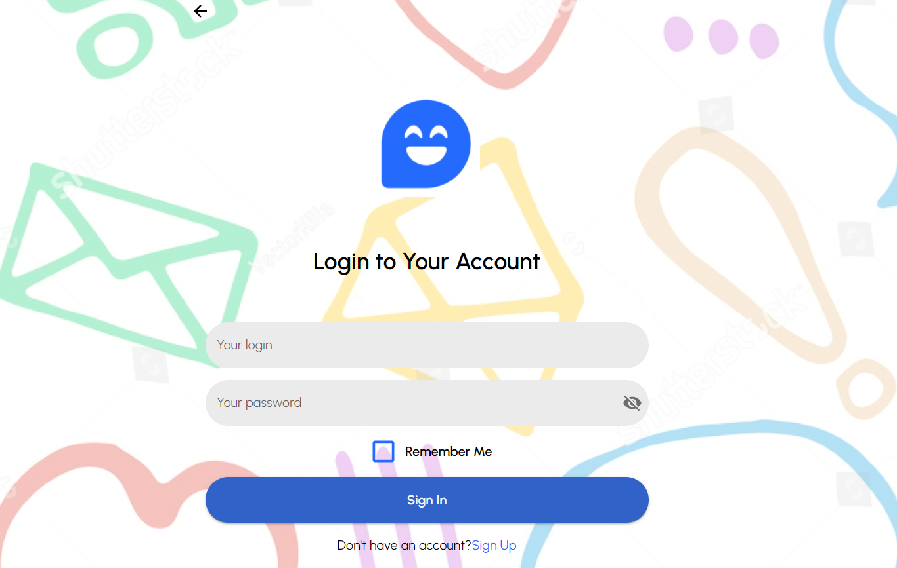
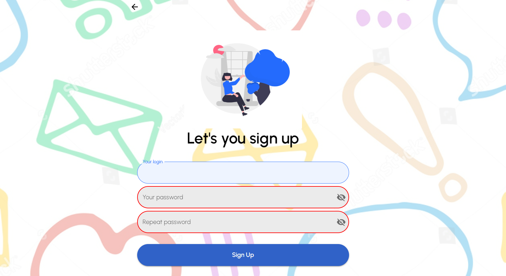
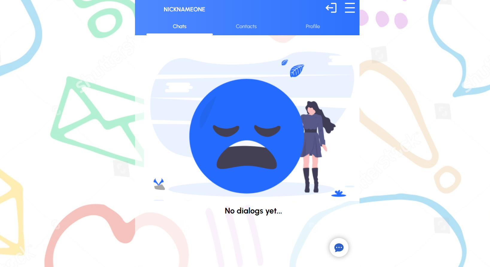
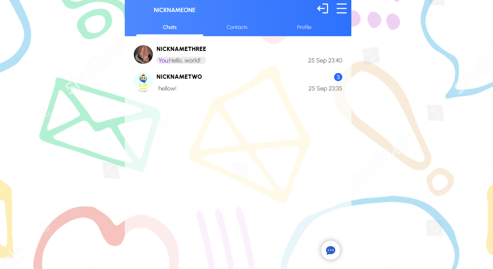
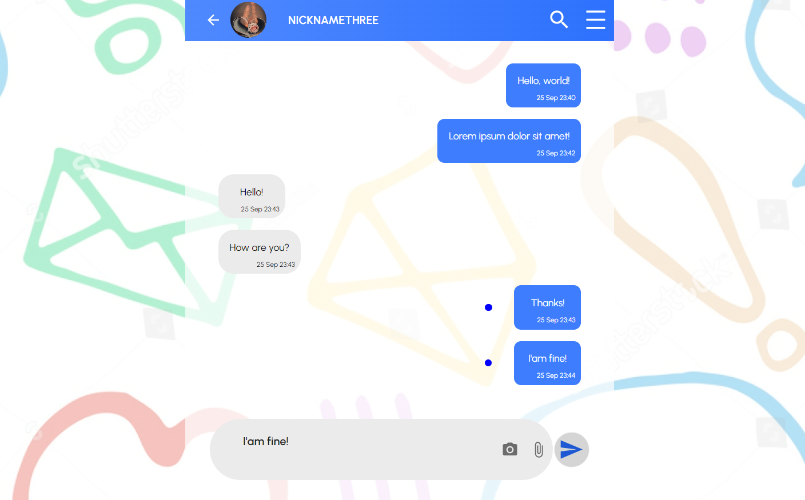
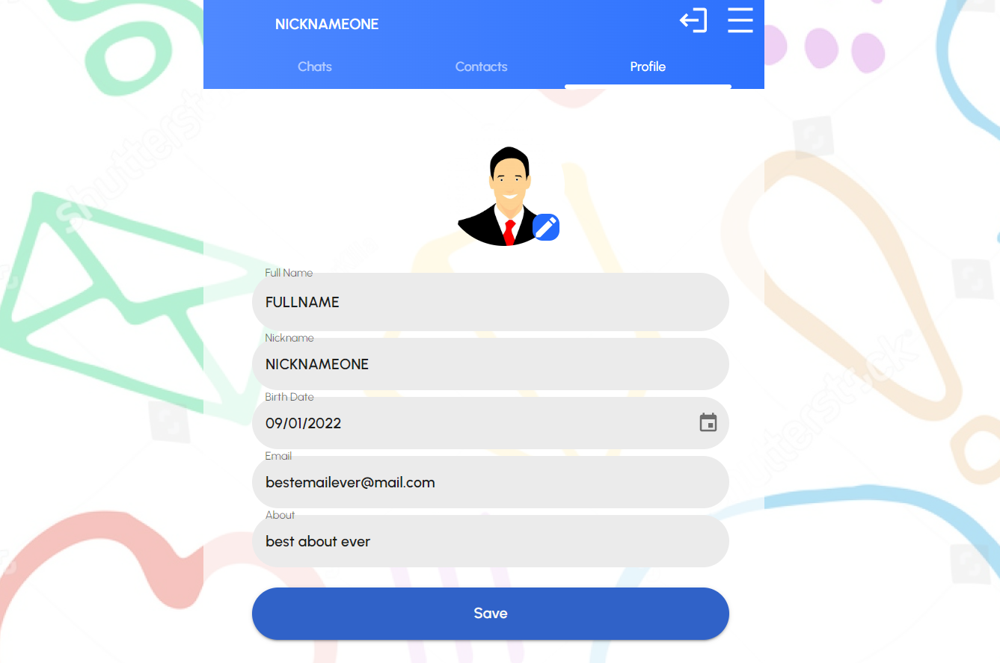

# Fullstack-JS-chat-app

## Mobile-first web chat application

A simple realtime chat application which was made using React JS, Node JS and MongoDB.

User interface of given software uses the reactive paradigm and is implemented as modern SPA. All specific components are connected with global store which is provided by redux toolkit. Diffrent pages interact with the own reducers only (code splitting technique introduced by reducers management approach).

Backend controllers and observers are implemented using Node JS. Observers are intended to monitor for changes of Mongo DB change streams. Mongo DB driver is provided by mongoose library.

Real time communication between client and server is provided by socket-io.

This is a responsive web application for viewing in both Mobile and Desktop.
Web application design was inspired by the HiChat - Messenger App UI Kit: https://www.figma.com/community/file/1121081020399174214. Components were made with materialui and react-spring for animations.

### Screenshots




### Key features

- Unreaded messages counting for each dialog;
- Unreaded message label in single dialog mode (implemented via intersection observer API);
- Online labels everywhere: contacts, chat items, dialog page;
- JWT authentification control;
- Redux code splitting technique (to optimize resource consumption);

### How to install the application correct

To install client and server dependencies just execute following commands in the root directory of application:

```
npm i
cd client
npm i
```

### How to config MongoDB

You need one of an available mongodb software releases (Atlas or run MongoDB locally):  
https://www.mongodb.com/docs/manual/.  
After you are necessory to create your own database with 3 named collections: Users, Dialogs and Messages.  
To complete configuration process adjust  
`server/Configs/mongodbConf.json`,  
`server/Configs/serverConf.json`,  
`client/src/serverConf.json`  
files in accordance with you requirements.

### How to build client (frontend)

```
cd client
npm run build
```


### Run in development mode

```
npm run dev
```

### Run in production mode

```
npm run prod
```